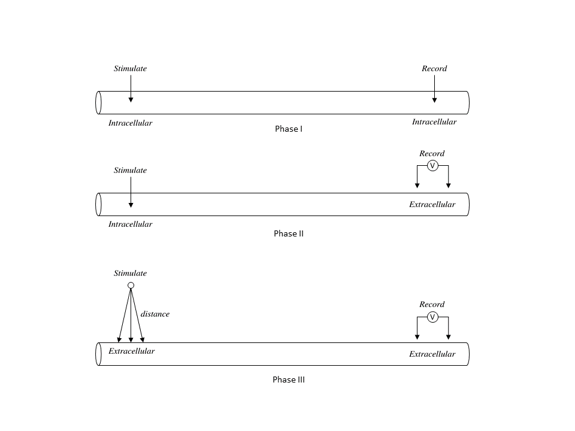

# NEURON-Based Nerve Bundle Model

## 1. Introduction
This project aims to develop a simplified nerve bundle model using the **NEURON** simulation environment to study the effect of **Electrode** to **Compound Action Potential (CAP)**.

The model will begin with a **single nerve fiber** and progressively advance to a more complex **nerve bundle**. The stimulation methodology transitions from **intracellular** electrode to extracellular electrode (only considering the **distance** between electrode and fiber) and ultimately to extracellular electrode (considering both distance and **membrane area**). Recording techniques will evolve from **intracellular** electrode to **extracellular** electrode.

## 2. Scope
For the nerve cell structure, the model will focus on **Axon**, omitting soma, dendritic structures, and neurotransmitter-mediated synaptic transmission. And this model will only consider the topology of the nerve, and ignore the anatomical shape.

This model will take into account a **general fiber bundle** without considering a specific part of the human body or an animal. And the stimulus is a **universal electrode** and does not correspond to a specific device.

## 3. Procedure
The project is divided into five distinct phases: 
- **3.1 Phase I**: Single neuron fiber, stimulation and recording via intracellular electrode. 
- **3.2 Phase II**: Single neuron fiber, stimulation via extracellular electrode (considering distance), recording via intracellular electrode. 
- **3.3 Phase III**: Single neuron fiber, stimulation via extracellular electrode, recording via extracellular electrode. 
- **3.4 Phase IV**: Nerve fiber bundle (considering fiber diameter variability), stimulation via extracellular electrode, recording via extracellular electrode. 
- **3.5 Phase V**: Nerve fiber bundle, stimulation via extracellular electrode (considering charge density to each fiber), recording via extracellular electrode. 

## 4. Schedule
|Procedure|Nerve|Stimulation|Record|Date|
|-|-|-|-|-|
|Phase I|Single|Intracellular|Intracellular|2025.03.05| 
|Phase II|Single|Extracellular (distance)|Intracellular|2025.03.07| 
|Phase III|Single|Extracellular (distance)|Extracellular|2025.03.11| 
|Phase IV|Multiple|Extracellular (distance)|Extracellular|2025.03.12| 
|Phase V|Multiple|Extracellular (charge density)|Extracellular|2025.03.13| 

## 5. Implementation
### 5.1 Programming Language
The model will be implemented using the **hoc** and **python** programming language.

### 5.2 File Architecture
- **Topology**: Definition of the modeled nerve fiber and nerve bundle structures.
- **Stimulation**: Implementation of various stimulation methods across different phases.
- **Record**: Implementation of different recording methods and data acquisition approaches.

## 6. Stimulation
### 6.1 Waveform
The simulation will incorporate different types of waveforms, including:
- **Single pulse stimulation**: A single short-duration stimulus.
- **Biphasic pulse stimulation**: Two-phase waveform for reducing charge accumulation.

### 6.2 Parameters
Each stimulation will be configured with different parameters:
- **Amplitude**: 0mA to 5mA
- **Duration**: 0 us to 2, 000 us
- **Waveform Type**: Square pulse, Biphasic pulse, Sinusoidal
- **Electrode-fiber distance**:
- **Fiber diameter**:
- **Charge density**:

## 7. Recording
- **Intracellular electrode**: Measures intracellular potential changes.
- **Extracellular electrode**: Measures the extracellular potential changes.
- **Compound action potential**: Sum the action potentials of different nerve fibers.

## 8. Outcome
The expected results from this project include:
- A nerve boundle model built with hoc file.
- Some figures and animations which show the compound action potential.
- A document show how to use the model.