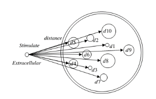

# Neuron Study Project Report 
## 2025/03/09---2025/03/15 
### Speaker: Ted Carnevale , Robert McDougal , Sharon Crook
#### 9:00am-17:00pm & 19:00pm evening session & 20:00pm Dr. Nobert meeting for project progress
## 1. Introduction
The NEURON Spring Course provides a comprehensive introduction to the design and construction of models of individual neurons and networks of neurons. It includes:

- **1**: Model specification with hoc, Python, and NEURON's GUI.
- **2**: Importing Neurolucida and other morphometric data formats via Python and the Import3D tool.
- **3**: Adding new biophysical mechanisms with NMODL and the Channel Builder.
- **4**: Multiscale modeling using RxD for reaction-diffusion.
- **5**: Using the Model View tool to analyze and understand models created by yourself and others.
- **6**: Integration methods.
    - **6.1**: Accuracy, stability, and computational efficiency
    - **6.2**: Fixed timestep vs. global and local adaptive integration--which method to use, and how to use it
- **7**: Introduction to using parallel hardware to speed up simulations of cells and networks.
- **8**: Customizing the GUI for simulation control and analysis of results.
- **9**: Managing modeling projects.

## Day 1 (03/09)
### Morning Session
- **1**: Introduction to modeling
- **2**: NEURON ENVIRONMENT installed and Setup
- **3**: Interactive exercise: building and using a simple model with the GUI
- **4**: Neurites, cables, and sections
- **5**: Range, range variables, nodes, and nseg
- **6**: Default units in NEURON

### Afternoon Session
- **7**: Interactive exercise: working with the Hodgkin-Huxley axon model
- **8**: Quick peek under the hood: how your Python Code is mapped into the cable eqaution
- **9**: A collision experiment, experiment, exploring spatial discretization, understanding anode breal excitation
- **10**: Constructing branched model cells with the CellBuilder
- **11**: Scripting NEURON

| Name | Email | Company/School | Position |
|----------|----------|----------|----------|
| Farooq Ahmad | farooq.ahmad@gmail.com | Google | Software Engineer at Google-Research and Machine Intelligence  |
| **Tim Balmer** | timthy.balmer@asu.edu | Arizona State University | Assistant Professor School of Life Sciences (Research on : How sensory signals are processed by the brain with a focus on hearing and balance) https://search.asu.edu/profile/3726040 |
| Riya Dahal | rdaha1@lsuhsc.edu | LSU Health Sciences Center | Interdisciplinary-PhD student |
|  | kdlxon24@asu.edu | Arizona State University | Bee lab-PhD student |
| **Mohamed W ElSayed** | mohamed.w.elsayed@dartmouth.edu | Geisel School of Medicine- Dartmouth | Clinical Assistant Professor of Psychiatry, New Hampshire Hospital, Staff Psychiatrist https://geiselmed.dartmouth.edu/faculty/facultydb/view.php/?uid=7930 |
| **Maria C Perez Flores** | mcperezflores@arizona.edu | Arizona State University | Associate Research Professor, Translational Neurosciences https://phoenixmed.arizona.edu/maria-cristina-perez-flores |
| Dolores Columba Perez Flores | dcperezflores@arizona.edu | Arizona State University | Researcher/Scientist III |
| Jawon Gim | jwgim@kbri.ro.kr | Korea Brain Research Institute | Reseacher/Scientist |
| Harsh Hariani | hhariani@asu.edu | Arizona State University | PhD Student - Mentor: Timothy Balmer, School of Life Sciences |
| Md Shafiul Alom Khan | mxk1575@case.edu | Case Western Reserve | PhD Studnet |
| **Kyle Lockwood** | k.lockwood@northeastern.edu | Northeastern University | PostDoc, Physical Therapy, Human Movement, and Rehabilitation Sciences  https://tuniklab.sites.northeastern.edu/|
| Alana Maluszczak | alana.maluszczak@utah.edu | University of Utah | brain imaging lab Biomdeical PhD Student |
| Shawn Mahoney | stmahone@asu.edu | Arizona State University | Animal Behavior PhD Students |
| Alan A. Diaz Montiel | alan.diazm@outlook.com | Nathan Kline Institute for Psychiatric Research | Research Scientist in NewYork and Houston https://scholar.google.com/citations?hl=en&user=gfL-ld8AAAAJ&view_op=list_works&sortby=pubdate |
| Orren Ravid | orrenravid1@gmail.com | Microsoft | Developing engaging event production tools for Microsoft’s immersive meeting and events platform Mesh |
| Erica Stutz | erica.stutz@yale.edu | Yale | PhD Student in Computational Biology and Biomedical Informatics |
| Wesley Tierney | Wesley.Tierney@asu.edu | Arizona State University | Interdisciplinary Graduate Program in Neuroscience PhD Students |
| **Pushpinder Walia** | walia.pu@northeastern.edu | Northeastern University |This is his mentor https://bouve.northeastern.edu/directory/eugene-tunik/ |

### No Evening Session
### Dr.Nobert Discussion
Start working on the project and get the permit for the NEURON forum.

## Day 2 (03/10)
### Morning Session
- **1**: Channel Builder
- **2**: Working with morphometric Data
- **3**: Lipid bilayer model
- **4**: Squid axon model

### Afternoon Session
- **5**: NMODL: the NEURON Model Description Language
- **6**: ModelDB and Model View
- **7**: Builing a model cell
- **8**: Branched cell model

### Evening Session
- **9**: Scripting NEURON
- **10**: Squid axon model and Branched Cell model
- **11**: The Channel Builder
- **12**: Working with morphometric data

### Dr.Nobert Discussion
Finish the Project Progress: Phase_i Single neuron fiber, stimulation and recording via Patch Clamp.

## Day 3 (03/11)
### Morning Session
- **1**: Reaction-diffusion
- **2**: Inhomogeneous channel distributions

### Afternoon Session
- **3**: Families of simulations in parallel
- **4**: Numerical methods: accuracy, stability, speed
- **5**: Lab tour for 
    - **5.1**: Balmer Lab (https://sites.google.com/asu.edu/balmerlab/home?authuser=0) The Balmer Lab is to discover how brain circuits function and how they contribute to behavior, with particular interest in those that underlie hearing and balance.  It is essential to discover what cell-types are present in these neural circuits, what their inputs and outputs are, and how their synapses transform neural signals.  By exploring how neurons process sensory signals we can discover how their disruption causes disorders of hearing including tinnitus and disorders of balance related to the function of the cerebellum. 
    - **5.2**: Bee Lab Annex. Discover the Bee's brain neuorn.

### No Evening Session
### Dr.Nobert Discussion
Finish the Project Progress: Phase_ii Multi neuron fiber (unmyelaxons and myelaxons), stimulation and recording via Patch Clamp.
And explain the different for Dr.Nobert what is nseg and seg in NEURON.(After discussion with Dr. Robert who is the speaker for this class)

